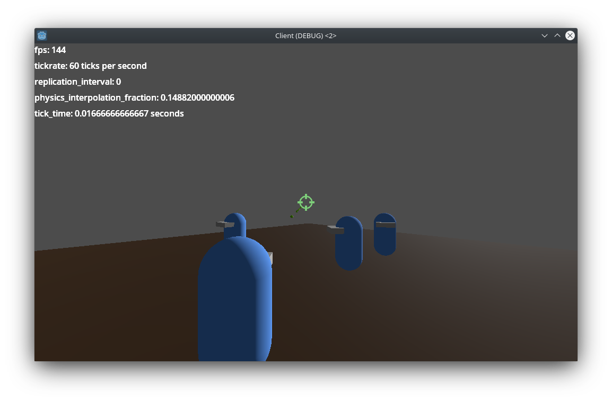

# Godot4Net

New update coming soon. This current implementation is outdated because networking (MultiplayerSpawner, MultiplayerSynchronizer) in godot4 is better now. And im removing the state Dictionaries and make everything more like standard approach.

This is a godot 4 project implementing dedicated multiplayer networking. \
Server and client are separated into two projects and its 3D thirdperson.

In this new version i removed the highlevel MultiplayerSynchronizer and MultiplayerSpawner nodes. \
So theres more networking logic required now but it gives more control. This way i can do things like "only send rpc if value has changed"

Any help is appreciated <3



## Import projects
```bash
/home/$USER/<your_git_dir>/Godot4Net/client/
/home/$USER/<your_git_dir>/Godot4Net/server/
```

## Headless server mode
you can run the server headless
```bash
Godot_v4.0.2-stable_linux.x86_64 --display-driver headless --path <your_git_dir>/Godot4Net/server/
```
There's a very limited cli. Server can be stopped by entering "stop", "quit" or "exit".

## Additional info
There are 2 state dictionaries: 

states_udp gathers all data we want to sync unreliable but fast. \
states_tcp gathers all data we want to sync reliable.

Every object that gets synchronized adds its values to one of those dictionaries, if the values have changed.


Because we gather all this data in two dictionaries we can easily use just one tcp and one udp rpc per server tick.
If we have values that have changed to sync.
(Its also planned to add a updaterate value)

### states_udp

example:
```json
{
  "moving_cube":
  {
    "MovingCube1":
    {
      "position":"(623.7565, 165, 63)"
    }
  },
  "player":
  {
    "1481316750":
    {
      "camera_arm_rotation":"(-0.072458, 0, 0)",
      "position":"(807.2864, 163.6185, -71.30477)"
    }
  }
}
```
### states_tcp

example:
```json
{
  "player":
  {
    "1481316750":
    {
      "camera_arm_scale":"(1, 1, 6)"
    }
  }
}
```

## Todo list
* shoot bullet
* updaterate
* chat
* on server remove textures etc.
* decouple code with signals
* instancing grass, trees, stones (either via particle or multimesh or shader?)
* create new world, add more assets
* player with custom bones, (mixamo? whats the license?) animations and root motion 

## Tested on

<a href="https://debian.org/">
  
  Debian GNU/Linux 12 (bookworm)
</a>

## Built With

<a href="https://godotengine.org/">
    
    Godot v4.0.2-stable
</a>
