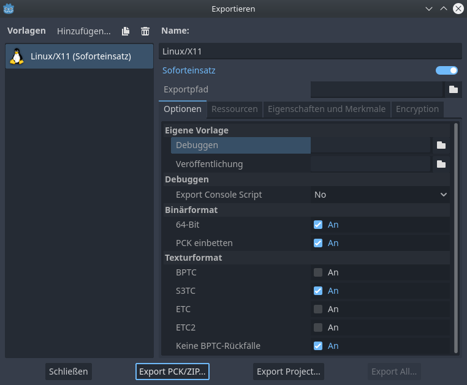

# Godot4Net
This is a godot 4 alpha test project to checkout the new network sync code. \
Server and client are separated into two projects and its 3D.
With global_state replication


## Install godot 4 alpha

```bash
# Create git directory
mkdir -p /home/$USER/git && /
cd /home/$USER/git && /

# Build and install godot4 and export tools
chmod u+x /home/$USER/git/Godot4Net/build_godot.sh && /
bash /home/$USER/git/Godot4Net/build_godot.sh
```

## Install Godot4Net

```bash
# Download Godot4Net from master branch
git clone https://github.com/MystixCode/Godot4Net.git
```

You need to open both projects with the godot editor atleast once and set the export templates:

1. open godot editor --> /home/$USER/git/godot/bin/godot.linuxbsd.tools.64
2. import client project --> /home/$USER/git/Godot4Net/client/project.godot
3. Project>Export>Add>Linux/X11
4. Click the embed PCK checkbox

repeat those steps with the server project



```bash
#build and run client and server
chmod u+x /home/$USER/git/Godot4Net/build_run_client_server.sh && /
bash /home/$USER/git/Godot4Net/build_run_client_server.sh
```

## Info
### global_state{} example
```bash
{
    player:{
        1183871435:[Spartan153, (-2, 1.000247, -3), (-0.7, 0.8), 200, 200],
        1939770442:[Spartan31, (-1, 1.000045, 3), (-0.733333, 0.233333), 200, 200]
    },
    bullet:{
        Bullet1:[1939770442, (-1, 5.140666, -78.666656)],
        Bullet2:[1939770442, (-1, 5.091667, -77.999992)],
        Bullet3:[1183871435, (-1, 4.206944, -69.333359)],

    },
    moving_cube:{
        MovingCube1:[(26.47962, 0.5, -20)]
    },
    rigid_cube:{
        RigidCube1:[(10, 0.5, -10), (0, 0, 0)]
    },
    other:{
    
    }
}
```
### Tested on:
- Debian GNU/Linux 11 (bullseye)
