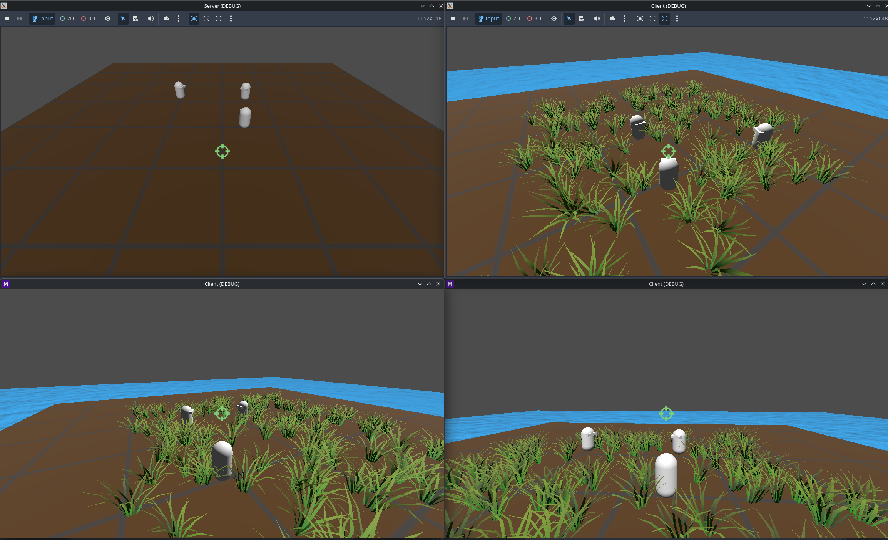

# Godot4Net

This is a godot 4 project implementing low-level multiplayer networking.
Server and client are separated into two projects and its 3D thirdperson.

Any help is appreciated <3



## Headless server mode
you can run the server headless
```bash
godot --display-driver headless --path git/Godot4Net/server/
```

## Tested on

<a href="https://ubuntu.com">
  Ubuntu 25.04 (plucky)
</a>

## Built With

<a href="https://godotengine.org/">
    
    Godot_v4.5-stable_linux.x86_64
</a>
