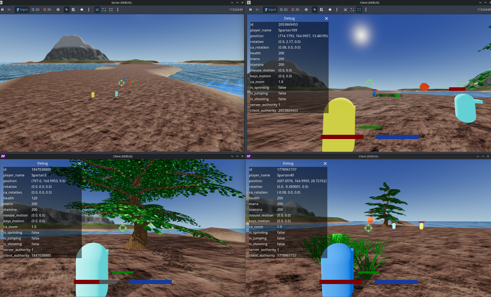

# Godot4Net
This is a godot 4 project implementing dedicated multiplayer networking. \
Server and client are separated into two projects and its 3D thirdperson.

In this new version i removed the highlevel MultiplayerSynchronizer and MultiplayerSpawner nodes. \
So theres more networking logic required now but it gives more control. This way i can do things like "only send rpc if value has changed"

Any help is appreciated <3



## Import projects
```bash
/home/$USER/<your_git_dir>/Godot4Net/client/
/home/$USER/<your_git_dir>/Godot4Net/server/
```

## Headless server mode
you can run the server headless
```bash
Godot_v4.0.2-stable_linux.x86_64 --display-driver headless --path <your_git_dir>/Godot4Net/server/
```
There's a very limited cli. Server can be stopped by entering "stop", "quit" or "exit".

## Todo list
* movingbody and rigidbody not networked yet
* shoot bullet
* updaterate
* chat
* on server remove textures etc.
* instancing grass, trees, stones (either via particle or multimesh or shader?)
* create new world, add more assets
* player with custom bones, (mixamo? whats the license?) animations and root motion 

## Tested on

<a href="https://debian.org/">
  
  Debian GNU/Linux 12 (bookworm)
</a>

## Built With

<a href="https://godotengine.org/">
    
    Godot v4.0.2-stable
</a>
